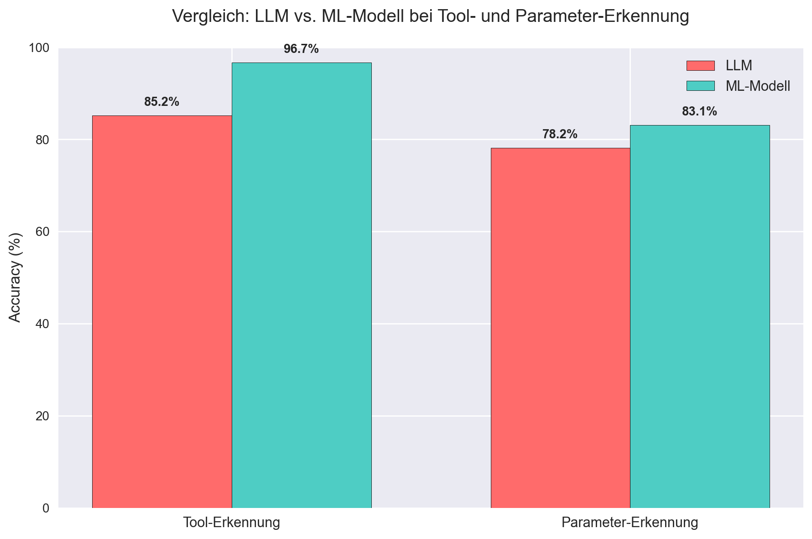

# ML vs. LLM: Tool- & Parametererkennung in Chatbot-Anfragen

> **+11,5 PP Accuracy** mit spezialisierten ML-Modellen vs. LLM  
> **Chi² = 119,61**, **p < 10⁻²⁷** – **höchst signifikant**  
> [Jupyter Notebook](./analysis.ipynb) • [Ergebnisse](#ergebnisse)

---

## Motivation

Im Rahmen eines **Chatbot-Tutorensystems** an der Hochschule Mittweida wird Studierenden die **Blockchain-Technologie** verständlich vermittelt.  
Ein zentrales Feature: **Automatische Erkennung von Tools und Parametern** aus Nutzeranfragen, z. B.:

> _„Encode my text ‘Hello World’ with base32.“_  
> → **Tool:** `base32_encoder` | **Parameter:** `'Hello World'`

Insgesamt wurden 29 verschiedene Tools verwendet, darunter Encoder und Decoder, Hash-Rechner, Bitcoin-Konverter und Wallet-Generatoren.

**Problem:**  
Das bisherige **generische LLM (Mistral-Small-3.1)** erkennt Tools oft **fehlerhaft** – oder gar nicht. 

**Lösung:**  
Zwei **eigens trainierte ML-Modelle** (RoBERTa-basiert) ersetzen das LLM für Tool- und Parameter-Erkennung.  
**Ziel dieses Projekts:** Statistischer Nachweis der Überlegenheit mittels **Chi-Quadrat-Test**.

---

## Methodik

| Komponente            | Beschreibung |
|-----------------------|------------|
| **Datensatz**         | 1.500 Nutzeranfragen (50 % echt, 50 % synthetisch generiert) |
| **Modelle**           | • **LLM:** `Mistral-Small-3.1-24B-Instruct-2503` (Zero-Shot)<br>• **ML Tool-Erkennung:** RoBERTa, fine-tuned mit PyTorch (>1.500 Samples)<br>• **ML Parameter-Erkennung:** RoBERTa, fine-tuned (>1.300 Samples) |
| **Evaluation**        | Python, `scikit-learn`, `scipy.stats.chi2_contingency` |
| **Metriken**          | Accuracy, Chi-Quadrat-Test auf Unabhängigkeit |

---

## Ergebnisse

| Aufgabe               | Modell     | Accuracy     | Verbesserung | Chi² (df=1) | p-Wert         |
|-----------------------|------------|--------------|--------------|-------------|----------------|
| **Tool-Erkennung**    | LLM        | **85,20 %**  | –            | –           | –              |
|                       | ML-Modell  | **96,67 %**  | **+11,47 PP**| **119,61**  | **7,70 × 10⁻²⁸** |
| **Parameter-Erkennung**| LLM        | **78,20 %**  | –            | –           | –              |
|                       | ML-Modell  | **83,07 %**  | **+4,87 PP** | **11,38**   | **7,44 × 10⁻⁴** |

> **Beide Unterschiede statistisch signifikant** (p << 0,001)



---

## Interpretation

- **Tool-Erkennung:** ML-Modell reduziert Fehler um **77,5 %** – **extrem robust**
- **Parameter-Erkennung:** Signifikante Verbesserung, aber noch Optimierungspotenzial
- **Fazit:** **Spezialisierte ML-Modelle > generisches LLM** – besonders bei sicherheitskritischen Tools

---

## Reproduzierbarkeit

- **Code:** [`analysis.ipynb`](./analysis.ipynb) (vollständig ausführbar)
- **Daten:** Nicht öffentlich (Datenschutz)
- **Synthetische Beispiele:** [`examples/synthetic_queries.txt`](./examples/synthetic_queries.txt)
- **Umgebung:** `requirements.txt`

```bash
pip install -r requirements.txt